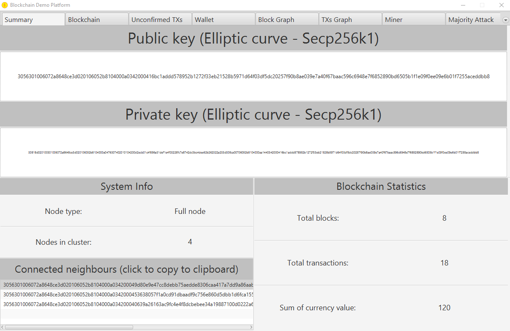
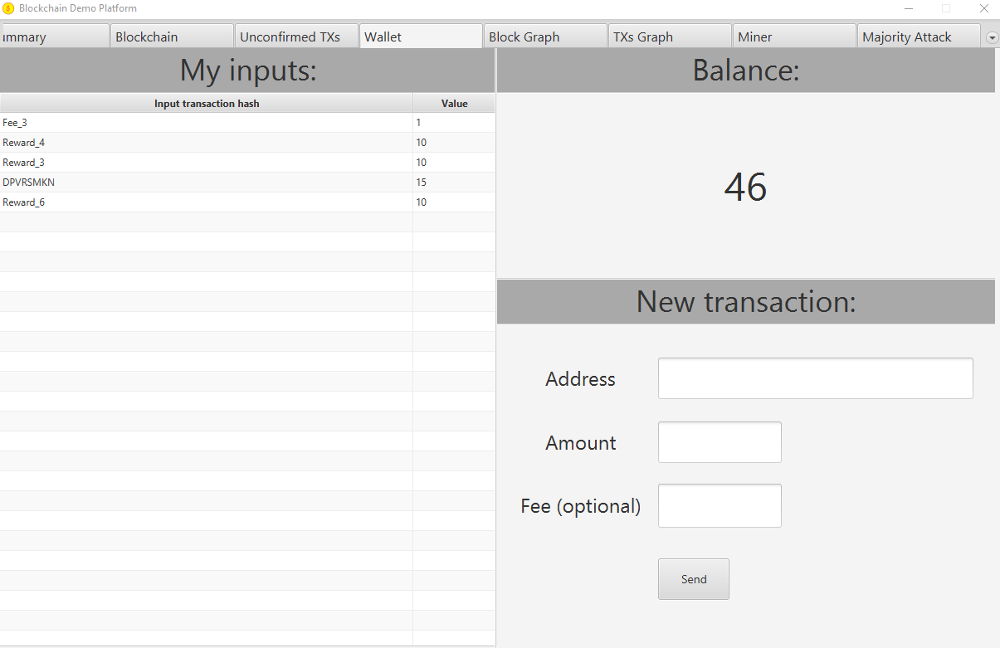
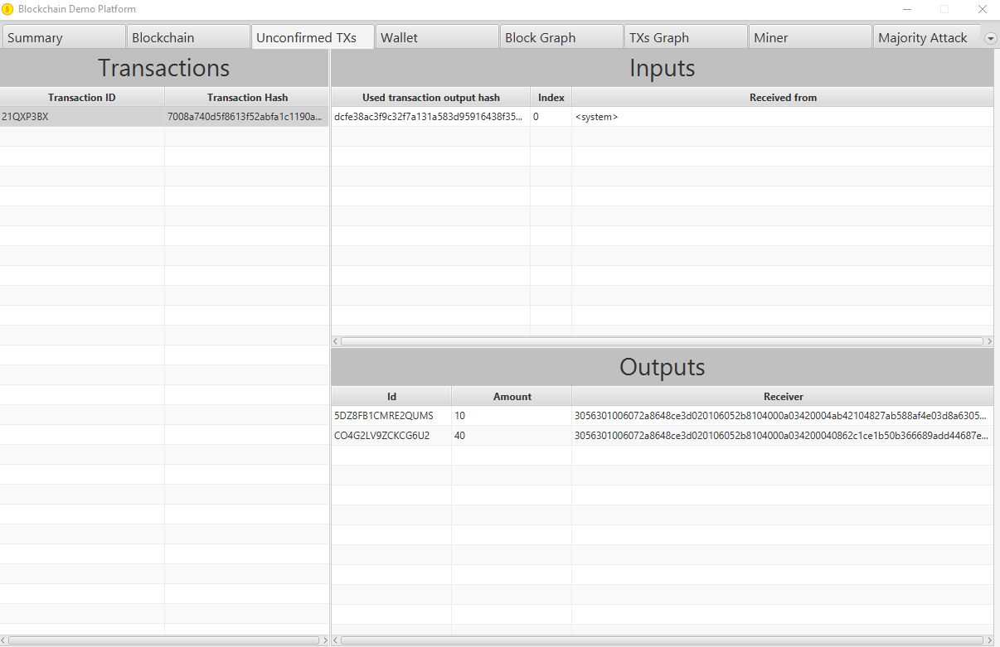
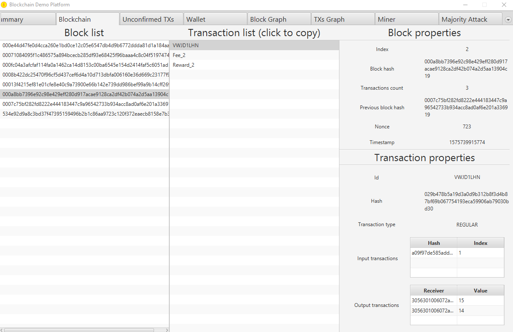

# Blockchain Demo Platform
[](https://travis-ci.org/pwegrzyn/Blockchain-Demo-Platform)

Blockchain demo platform for educational purposes. Fully featured Blockchain platform with block and transactions history visualization, ready to be run on a LAN. Includes a GPU hash miner module.









## Prerequisites
* JDK8+ or JDK12 and OpenJFX (check out `pom.xml` for more info)

## Starting
```bash
mvn package
java -jar <generated.jar> <path_to_config_file>
```

## Note
*This project was created as part of the Bachelor Thesis "Blockchain demo platform for educational purposes" for AGH-UST (2019) by
Grzegorz Frejek, Konrad Radon and Patryk Wegrzyn.*
